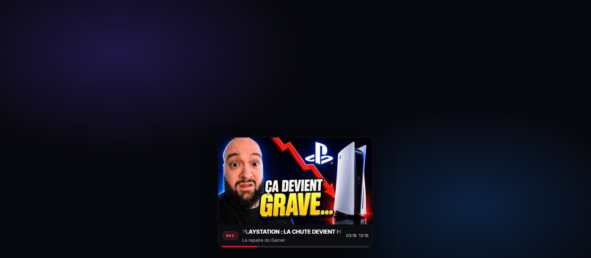
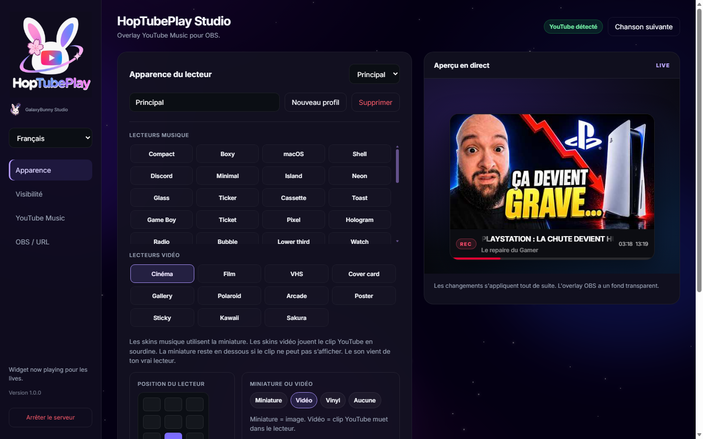
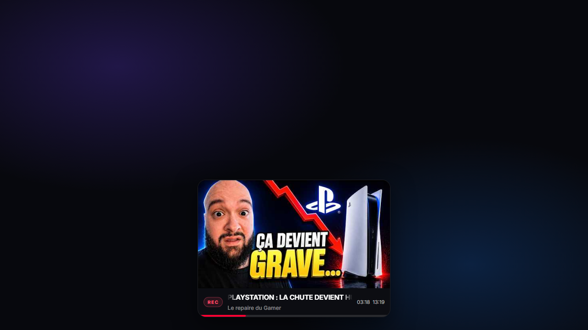

<p align="center">
  
</p>

<h1 align="center">HopTubePlay</h1>
<p align="center"><strong>GalaxyBunny Studio</strong> · overlay now playing YouTube</p>

<p align="center">
  Overlay local pour <strong>OBS</strong> et <strong>Streamlabs</strong> — titre, artiste, clip YouTube muet, skins Galaxy Bunny.<br>
  Détection Windows automatique. Mode démo sans compte. Le son reste sur ton vrai lecteur.
</p>

<p align="center">
  <a href="https://hanacherry.github.io/hoptubeplay/"></a>
  <a href="LICENSE"></a>
  <a href="package.json"></a>
  <a href="https://github.com/HanaCherry/hoptubeplay/releases/latest"></a>
</p>

<p align="center">
  <a href="README.md">Français</a> ·
  <a href="README.en.md">English</a> ·
  <a href="https://hanacherry.github.io/hoptubeplay/?lang=es">Español</a> ·
  <a href="https://hanacherry.github.io/hoptubeplay/?lang=pt">Português</a> ·
  <a href="https://hanacherry.github.io/hoptubeplay/?lang=de">Deutsch</a> ·
  <a href="https://hanacherry.github.io/hoptubeplay/?lang=it">Italiano</a> ·
  <a href="https://hanacherry.github.io/hoptubeplay/?lang=ja">日本語</a> ·
  <a href="https://hanacherry.github.io/hoptubeplay/?lang=ko">한국어</a> ·
  <a href="https://hanacherry.github.io/hoptubeplay/?lang=zh">简体中文</a> ·
  <a href="https://hanacherry.github.io/hoptubeplay/?lang=zh-TW">繁體中文</a> ·
  <a href="https://hanacherry.github.io/hoptubeplay/?lang=ar">العربية</a> ·
  <a href="https://hanacherry.github.io/hoptubeplay/?lang=ru">Русский</a> ·
  <a href="https://hanacherry.github.io/hoptubeplay/?lang=hi">हिन्दी</a> ·
  <a href="https://hanacherry.github.io/hoptubeplay/?lang=tr">Türkçe</a> ·
  <a href="https://hanacherry.github.io/hoptubeplay/?lang=pl">Polski</a> ·
  <a href="https://hanacherry.github.io/hoptubeplay/?lang=nl">Nederlands</a> ·
  <a href="https://hanacherry.github.io/hoptubeplay/?lang=id">Bahasa Indonesia</a> ·
  <a href="https://hanacherry.github.io/hoptubeplay/?lang=vi">Tiếng Việt</a> ·
  <a href="https://hanacherry.github.io/hoptubeplay/?lang=th">ไทย</a> ·
  <a href="https://hanacherry.github.io/hoptubeplay/?lang=uk">Українська</a> ·
  <a href="https://hanacherry.github.io/hoptubeplay/?lang=sv">Svenska</a> ·
  <a href="https://hanacherry.github.io/hoptubeplay/?lang=cs">Čeština</a> ·
  <a href="https://hanacherry.github.io/hoptubeplay/?lang=ro">Română</a> ·
  <a href="https://hanacherry.github.io/hoptubeplay/?lang=el">Ελληνικά</a> ·
  <a href="https://hanacherry.github.io/hoptubeplay/?lang=hu">Magyar</a> ·
  <a href="https://hanacherry.github.io/hoptubeplay/?lang=fi">Suomi</a> ·
  <a href="https://hanacherry.github.io/hoptubeplay/?lang=da">Dansk</a> ·
  <a href="https://hanacherry.github.io/hoptubeplay/?lang=no">Norsk</a> ·
  <a href="https://hanacherry.github.io/hoptubeplay/?lang=he">עברית</a> ·
  <a href="https://hanacherry.github.io/hoptubeplay/?lang=ca">Català</a> ·
  <a href="https://hanacherry.github.io/hoptubeplay/?lang=ms">Bahasa Melayu</a> ·
  <a href="https://hanacherry.github.io/hoptubeplay/?lang=tl">Filipino</a>
</p>

<p align="center">
  <a href="https://hanacherry.github.io/hoptubeplay/">Site de présentation</a>
  ·
  <a href="https://github.com/HanaCherry/hoptubeplay/releases/latest">Dernière release</a>
  ·
  <a href="https://github.com/HanaCherry/hopplay">HopPlay (Spotify)</a>
</p>

<p align="center">
  
</p>

## Le clip en cours, sur le stream

HopTubePlay est un **overlay now playing YouTube** pour streamers : tableau de bord local, 56 skins dont **Cinéma** et **Galaxy Bunny**, fond transparent pour OBS / Streamlabs, jusqu’à 5 profils.

C’est un **lecteur de clip**, pas un lecteur audio. Les skins vidéo jouent le clip YouTube **en sourdine** dans le player. Le son vient de ton onglet YouTube. La miniature reste en dessous si le clip ne peut pas s’afficher.

Le **mode démo** fonctionne sans compte. Rien n’est envoyé vers un serveur GalaxyBunny.

## Aperçu

<p align="center">
  
</p>

<p align="center">
  
</p>

## Fonctions

- **56 skins** — lecteurs musique et lecteurs vidéo (Cinéma, Film, VHS, Galaxy Bunny, kawaii, sakura…)
- **Clip YouTube muet** — le player montre le clip ; le son reste sur ton vrai lecteur
- **Détection Windows** — YouTube ou YouTube Music dans Chrome / Edge, sans app obligatoire
- **Overlay OBS / Streamlabs** — source Navigateur, fond transparent, 9 positions
- **Apparence** — couleurs magiques, lueur, flou, miniature / vidéo / vinyle
- **5 profils** — URL OBS et taille séparées
- **Privé par conception** — le serveur écoute `127.0.0.1` ; `data/` n’est pas publié

## Démarrage

Installez [Node.js 18+](https://nodejs.org), puis :

```sh
git clone https://github.com/HanaCherry/hoptubeplay.git
cd hoptubeplay
npm install
npm start
```

Ouvrez `http://127.0.0.1:3001`. Le mode démo fonctionne tout de suite.

Sous Windows, `start.bat` lance aussi le serveur. `stop.bat` l’arrête.

HopTubePlay utilise le port **3001** (HopPlay reste sur **3000**).

## OBS / Streamlabs

1. Démarrez HopTubePlay et laissez-le ouvert pendant le stream.
2. Copiez l’URL de l’overlay dans le dashboard.
3. Ajoutez une source **Navigateur**.
4. Collez l’URL. Fond transparent.

Taille conseillée : **1920 × 1080**.

Lance une vidéo YouTube dans Chrome ou Edge : l’overlay suit le titre Windows.

## YouTube (optionnel avancé)

La détection Windows suffit dans la plupart des cas. [Pear Desktop](https://github.com/pear-devs/pear-desktop) reste une option avancée (plugin Amuse `9863` / API Server `26538`) si tu en as besoin.

Ne commitez jamais les secrets. Ils restent dans `data/` (gitignored).

## Licence

MIT © GalaxyBunny Studio

HopTubePlay est un projet indépendant. YouTube, YouTube Music et OBS appartiennent à leurs détenteurs. Non affilié.
